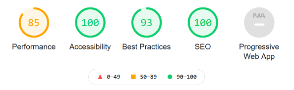

# Projet La Chouette Agence

date de début: 30/11/2020

## Projet 4 du parcours développeur web d'Openclassrooms

### Objectif: Optimisez un site web existant

Optimiser un site web existant pour le rendre plus accessible
Générer un audit du site d'un point de vue SEO et Accessibilité et en tirer 10 recommandations.
Mettre en place ces 10 recommandations et démontrer l'impact de ces recommandations en comparant les résultats dans un rapport d'optimisation.

**Ce repository permet de faire les modifications sur le site et de le mettre en ligne pour analyser les résultats.**

Ce site optimisé est visible à l'adresse : https://marionlauzier.github.io/_4_30112020_optimised/

Le site d'origine est stocké sur cet autre repository: https://github.com/MarionLauzier/_4_30112020_starting et est accessible à l'adresse : https://marionlauzier.github.io/_4_30112020_starting/

 
    Résultat de l'audit après optimisation avec l'outil Lighthouse: 
     

